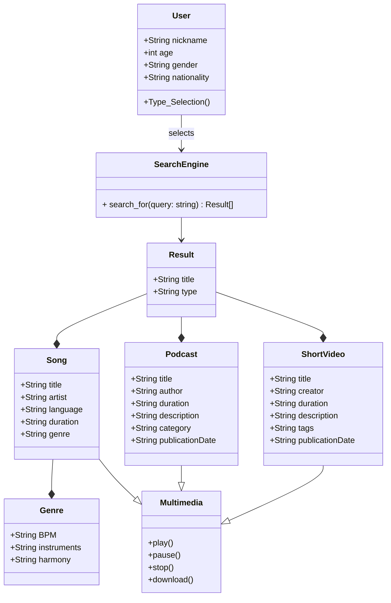

## Reto_02
Reto 02-Programación Orientada a Objetos

El problema a modelar fue la interacción entre un usuario y un buscador de contenido digital, que permitiese seleccionar entre contenido como música, podcasts y videos cortos. Las clases que definen a cada tipo de contenido, heredan métodos de otra clase Multimedia que permite reproducir, parar, pausar o descargar el contenido. La interacción con el usuario se da mediante una solicitud de un string donde digite el contenido que quiere ver. 

